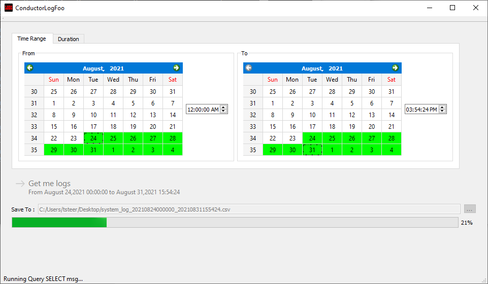
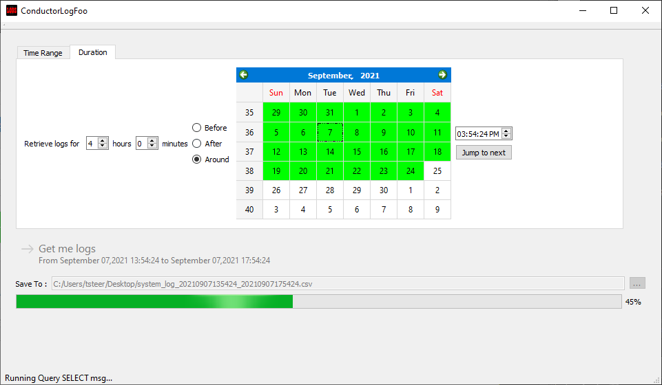

# ConductorLogFoo

ConductorLogFoo is a tool for extracting log data from ETC's Conductor product.

Although the inbuilt WebUI allows limited extraction of data, it is not very convenient for large amounts of data. This tool connects to the Conductor database and can extract unlimited data as a .CSV file for examination

# How to Use ConductorLogFoo
To use the tool, download the latest installer from the [Releases](https://github.com/ETCLabs/ConductorLogFoo/releases) page.

The first screen allows you to connect to your Conductor. Enter the IP address, username and password.

Once connected, you have two ways to retrieve logs, using either a Time Range, or a duration

## Time range

When you select time range, the two calendar views allow you to specify a start and an end date and time. The days which have data in Conductor are highlighted in green.

Once you have selected the range, press the `Get me logs` button to start the process of retrieving the log data.

## Duration

In the duration window you select a single day and time, and then select the duration around that time which you want logs for. This can be useful when troubleshooting an event that happened at a known time, for example.

Enter the date and time, and the amount of time before, after or around that time you want logs for. Again press the button to retrieve the data.

# About this ETCLabs Project
ConductorLogFoo is designed to interact with ETC products, but it is not official ETC software. For challenges using, integrating, compiling, or modifying items in this project, we encourage posting on the Issues page. ConductorLogFoo is a community-supported initiative, and the community is the best place to ask for help!